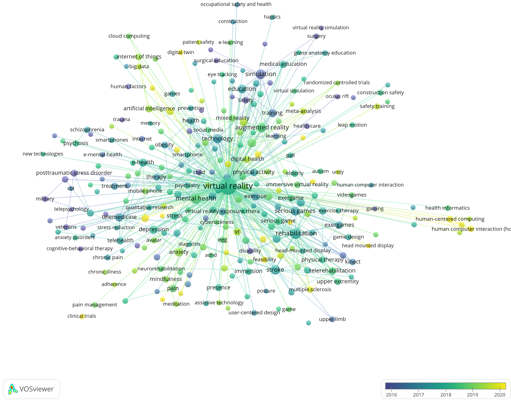

# The Health Metaverse
Since Metaverse starts to become a hot topic in recent years, it is necessary to investigate the potential applications of *Health Metaverse* or *Medical Metaverse* in the future. 

> The Covid-19 pandemic has triggered an unprecedented acceleration and adoption of emerging technologies and has acutely highlighted the vulnerabilities we have in managing global population health, as well as the opportunities offered by deploying innovative solutions powered by these emerging technologies. The *Health Metaverse* could be one of the solutions addressing several global healthcare challenges. All aspects of the global healthcare ecosystem will need to undergo a profound digital transformation and disruption in processes, workflows, practices and delivery methods.  From: [How the metaverse will transform health](https://vitaminz.substack.com/p/how-the-metaverse-will-transform)

This is a research project focusing on the development of metaverse in the medical and health field. 

New project website is [here](https://health-metaverse.github.io/). 

##  Project Goal

Here we present a collection of news and papers related to *Health Metaverse*. 

Please contribute this project by providing more valuable references of Health Metaverse in the [Issues](https://github.com/dhchenx/health-metaverse/issues). 

 

## Articles and Blogs

[The Health Metaverse – A New Frontier?](https://coruzant.com/health-tech/the-health-metaverse-a-new-frontier/)

[Everything You Need To Know About The Metaverse](https://www.protocol.com/metaverse-meaning?rebelltitem=1#rebelltitem1)

[Seoul will be the first city government to join the metaverse](https://qz.com/2086353/seoul-is-developing-a-metaverse-government-platform/)

[Roblox and Healthcare’s Metaverse](https://thehealthcareblog.com/blog/2021/03/16/roblox-and-healthcares-metaverse/)

[Metaverse can help overcome challenges of medical training](http://www.koreabiomed.com/news/articleView.html?idxno=11602)

[Rise of Metaverse in Healthcare](https://www.taliun.com/p/rise-of-metaverse-in-healthcare)

[What does the metaverse hold for healthcare?](https://www.sagentiainnovation.com/insights/what-does-the-metaverse-hold-for-healthcare/)

[Is There a Place for Healthcare in the Metaverse?](https://healthmanagement.org/c/it/post/is-there-a-place-for-healthcare-in-the-metaverse)

[Facebook’s Evolution Into ‘Meta’ Has Incredible Potential To Revolutionize Healthcare](https://www.forbes.com/sites/saibala/2021/10/30/facebooks-evolution-into-meta-has-incredible-potential-to-revolutionize-healthcare/?sh=30b5afe15c5f)

[Navigating The Metaverse Through Online Community](https://advertisingweek.com/navigating-the-metaverse-through-online-community/)

[The metaverse is the next venue for body dysmorphia online](https://www.technologyreview.com/2021/11/16/1040174/facebook-metaverse-body-dysmorphia)

[Why you should care about Facebook’s big push into the metaverse](https://www.vox.com/recode/22799665/facebook-metaverse-meta-zuckerberg-oculus-vr-ar)

[Op-ed: What you hear about Covid in the Metaverse should scare you](https://www.cnbc.com/2021/11/18/op-ed-what-you-hear-about-covid-in-the-metaverse-should-scare-you.html)

[Metaverse medical treatment may come earlier than Metaverse](https://coinyuppie.com/metaverse-medical-treatment-may-come-earlier-than-metaverse/)

[Bringing The Medical Field To The Blockchain Metaverse](https://blockchainusa.tech/index.php/2021/11/21/bringing-the-medical-field-to-the-blockchain-metaverse/)

[Surgeons cautiously embrace medical metaverse](https://venturebeat.com/2021/11/12/surgeons-cautiously-embrace-medical-metaverse/)

[How the metaverse will transform health](https://vitaminz.substack.com/p/how-the-metaverse-will-transform)

[MedRoom bets on the metaverse to reshape distance learning in medical schools](https://labsnews.com/en/articles/business/medroom-metaverse-startup-edtech-distance-learning-medicine/)

[The Next Frontier For Healthcare: Augmented Reality, Virtual Reality, And The Metaverse](https://www.forbes.com/sites/saibala/2021/11/29/the-next-frontier-for-healthcare-augmented-reality-virtual-reality-and-the-metaverse/?sh=7c395c928943)

[Facebook’s Evolution Into ‘Meta’ Has Incredible Potential To Revolutionize Healthcare](https://www.forbes.com/sites/saibala/2021/10/30/facebooks-evolution-into-meta-has-incredible-potential-to-revolutionize-healthcare/?sh=83d8a4b5c5fe)

[The Metaverse of Health](https://venturedesktop.substack.com/p/the-metaverse-of-health)

[Healthcare in Metaverse](https://medium.com/illumination/health-care-in-metaverse-d16526e80ad9)

[Taking Healthcare Into the Metaverse](https://www.linkedin.com/pulse/taking-healthcare-metaverse-patrice-bergman?trk=articles_directory)

[Introducing the healthcare metaverse](https://www.medicalindependent.ie/introducing-the-healthcare-metaverse/)

[Treatment Announces Global Medical Metaverse](https://www.globenewswire.com/news-release/2021/11/04/2327635/0/en/Treatment-Announces-Global-Medical-Metaverse.html)

[Virtual Reality in Healthcare](https://visualise.com/virtual-reality/virtual-reality-healthcare)

[Crypto Docs NFTs from Ultimaxx Health's Symbiotic Marketplace: Bringing The Medical Field To The Blockchain Metaverse](https://www.newsfilecorp.com/release/104510/Crypto-Docs-NFTs-from-Ultimaxx-Healths-Symbiotic-Marketplace-Bringing-The-Medical-Field-To-The-Blockchain-Metaverse)

[Who's building the metaverse?](https://www.reuters.com/technology/whos-building-metaverse-2021-11-01/)

[Microsoft Mesh: A New “Holoportation” & Mixed Reality Platform That May Disrupt Healthcare](https://www.forbes.com/sites/saibala/2021/03/07/microsoft-mesh-a-new-holoportation--mixed-reality-platform-that-may-disrupt-healthcare/?sh=468d8a233d98)

[5 Ways Medical Virtual Reality Is Already Changing Healthcare](https://medicalfuturist.com/5-ways-medical-vr-is-changing-healthcare/)

[Applications of Virtual Reality in Healthcare](https://www.vrdirect.com/blog/vr-in-healthcare/applications-of-virtual-reality-in-healthcare/)

[Bump Galaxy: Mental Healthcare Metaverse](https://movinginstasis.com/project/bump_galaxy_mental_healthcare_metaverse)

[Metaverse in operating room is changing medicine rapidly](https://www.koreabiomed.com/news/articleView.html?idxno=11477)

[Healthcare in the metaverse?](https://digmedia.lucdh.nl/2021/11/30/healthcare-in-the-metaverse/)

[The first metaverse experiments? Look to what’s already happening in medicine](https://www.cnbc.com/2021/12/04/the-first-metaverse-experiments-look-to-whats-happening-in-medicine.html)

[The Medical Metaverse](https://www.christophejauquet.com/post/the-medical-metaverse)

[How metaverse could play a role in reshaping healthcare](https://www.cnbctv18.com/business/this-japanese-fashion-mogul-spacefarer-will-give-away-cash-from-outer-space-11744362.htm)

[Creating “metahealth” in the metaverse](https://www.auroracomms.com/digital/creating-metahealth-in-the-metaverse)

['Health City' - Aimedis Publishes Health-Metaverse and Will Soon Open the First Clinic In It](https://www.standard-freeholder.com/newsfile/107310-health-city-aimedis-publishes-healthmetaverse-and-will-soon-open-the-first-clinic-in-it)

[Extended Reality In Healthcare: 3 Reasons The Industry Must Get Ready For AR And VR](https://bernardmarr.com/extended-reality-in-healthcare-3-reasons-the-industry-must-get-ready-for-ar-and-vr/)

[TOP NEWSMetaverse And How It Is Helping The Medical Field?](https://powdersvillepost.com/metaverse-how-helping-medical-field/)

[How Metaverse could play a role in overhauling healthcare](https://goodwordnews.com/how-metaverse-could-play-a-role-in-overhauling-healthcare/)

[What is the Metaverse?: A surgeon simple perspective](https://www.corycalendinemd.com/post/what-is-metaverse-a-surgeons-simple-perspective)

[Meta opens up access to its VR social platform Horizon Worlds](https://www.theverge.com/2021/12/9/22825139/meta-horizon-worlds-access-open-metaverse)

[A Look at the First Medical Metaverse](https://www.dailyadvent.com/news/3d43e585ebe5689e468821619fe2706e-A-Look-at-the-First-Medical-Metaverse-By-DailyCoin)

[How the Metaverse can solve ambulatory health care’s biggest problem](https://www.oodpt.com/single-post/how-the-metaverse-can-solve-ambulatory-health-care-s-biggest-problem)

[The Role of Metaverse in Revolutionizing Medical Education](https://ourplnt.com/metaverse-medical-education/)

[The first metaverse experiences? Look at what’s already happening in medicine](https://www.uktimenews.com/the-first-metaverse-experiences-look-at-whats-already-happening-in-medicine/)

[Metaverse is not a utopian healthcare field that has already benefited from it](https://coinyuppie.com/metaverse-is-not-a-utopian-healthcare-field-that-has-already-benefited-from-it/)

[The Metaverse and Healthcare - Part 1](http://oxiohealth.io/the-metaverse-part-1/)

[The Metaverse and Healthcare - Part 2](http://oxiohealth.io/the-metaverse-and-healthcare-part-2/)

[The metaverse is already here. The debate now is over who should own it](https://health.wusf.usf.edu/2021-11-18/the-metaverse-is-already-here-the-debate-now-is-over-who-should-own-it)

[How the Metaverse Could Be Good for Your Health](https://www.youmustgethealthy.com/2021/09/how-metaverse-good-for-your-health.html)

[GOAL: With the “metaverse”, Facebook boosts the healthcare industry](https://oicanadian.com/goal-with-the-metaverse-facebook-boosts-the-healthcare-industry/)

[HEALTHCAREUK's DeHealth to Create a 3D Healthcare Metaverse](https://www.pymnts.com/healthcare/2021/uks-dehealth-to-create-a-3d-healthcare-metaverse/)

[Metaverse Learning: Health & Social Care](https://metaverselearning.co.uk/health-and-social-care/)

[Aimedis is building health metaverse with its own chain of clinics](https://gettotext.com/aimedis-is-building-health-metaverse-with-its-own-chain-of-clinics/)

[How the metaverse will revolutionize health](https://playcrazygame.com/2021/12/24/how-the-metaverse-will-revolutionize-health-epoca-negocios/)

[Limoverse – A Star To Rise In The Metaverse Horizon Built On Blockchain](https://www.outlookindia.com/website/story/outlook-spotlight-limoverse-a-star-to-rise-in-the-metaverse-horizon-built-on-blockchain/406450)

[An AI Universe, a Metaverse, or both?](https://www.deccanherald.com/opinion/an-ai-universe-a-metaverse-or-both-1064752.html)

[Misinformation already present in the metaverse](https://www.straitstimes.com/tech/tech-news/misinformation-already-present-in-the-metaverse)

[Healthcare Metaverse Set to Take Off With the Launch of the Metaverse Doctors Alliance in South Korea](https://www.einnews.com/pr_news/558633223/healthcare-metaverse-set-to-take-off-with-the-launch-of-the-metaverse-doctors-alliance-in-south-korea)

[How the metaverse can help students and teachers adapt to a post-pandemic world](https://www.scmp.com/comment/opinion/article/3160672/how-metaverse-can-help-students-and-teachers-adapt-post-pandemic)

[The world's first healthcare metaverse from DeHealth](https://www.prnewswire.com/news-releases/the-worlds-first-healthcare-metaverse-from-dehealth-301449862.html)

[Metaverse in healthcare](http://www.fayzak.com/metaverse-in-healthcare/)

[Metaverse Technologies and Its Applications](https://insights2techinfo.com/metaverse-technologies-and-their-applications/)

[Trends 2022: The metaverse and healthcare innovations to feature more in our lives](https://www.iol.co.za/lifestyle/health/trends-2022-the-metaverse-and-healthcare-innovations-to-feature-more-in-our-lives-d99bc256-33ac-4daa-93fd-6c0f0e5dd605)

[Benefits of Metaverse in Healthcare](https://tecarticles.com/benefits-of-metaverse-in-healthcare/)

[HEALTH Metaverse and Health Care - A view from 50,000 feet – Health Care Blog](https://x99news.com/2021/09/14/metaverse-and-health-care-a-view-from-50000-feet-health-care-blog/)

[From robots to the metaverse: How Intuitive Surgical is changing the face of medical surgery](https://www.businesstimes.com.sg/wealth-investing/from-robots-to-the-metaverse-how-intuitive-surgical-is-changing-the-face-of-medical)

[A Look at the First Medical Metaverse](https://cricketbet99.com/a-look-at-the-first-medical-metaverse/)

## Research Papers

[A Survey on Metaverse: the State-of-the-art, Technologies, Applications, and Challenges](https://arxiv.org/abs/2111.09673)

[Virtual worlds and health: Healthcare delivery and simulation opportunities](https://www.igi-global.com/chapter/virtual-worlds-health/55412)

[What is a metaverse?](https://www.sciencedirect.com/science/article/abs/pii/S0262407921014500)

[Building socioemotional environments in metaverses for virtual teams in healthcare: A conceptual exploration](https://link.springer.com/chapter/10.1007/978-3-642-29361-0_3)

[Educational applications of metaverse: possibilities and limitations](https://www.jeehp.org/m/journal/view.php?number=424)

## Videos

[The Metaverse and How We'll Build It Together -- Connect 2021](https://www.youtube.com/watch?v=Uvufun6xer8)

[Everything Facebook revealed about the Metaverse in 11 minutes](https://www.youtube.com/watch?v=gElfIo6uw4g)

[Explore the Medical Metaverse with Elucis](https://www.youtube.com/watch?v=Wt8an9e_4Jk)

[Fitness in the metaverse](https://www.youtube.com/watch?v=hlniOe5uQ3Q)

## Companies

[Mark Zuckerberg's Meta](https://about.facebook.com/meta/)

[Microsoft](https://news.microsoft.com/innovation-stories/mesh-for-microsoft-teams/)

[Some Companies building Metaverse](https://www.plainconcepts.com/metaverse-companies/#Ali_Metaverse_of_Alibaba)

